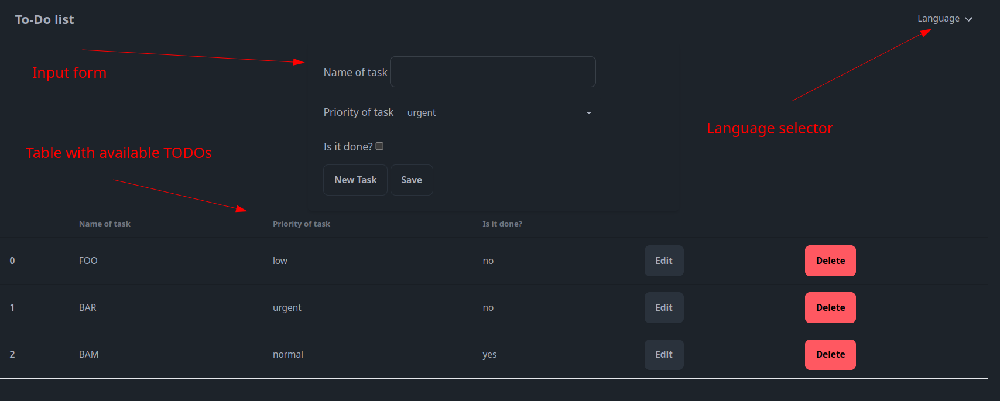

Prerequisites:

- Java 17+
- Docker
- Docker-Compose

How-to start testing or developing:

1. Navigate to the project's folder in a terminal
2. Execute:

```bash
make help
  ```

to print out all available options and pick a needed one.

**To run the application fully in Docker** execute:

```bash
make app-playground
```

After all related steps are done, you should be able to access the UI under: http://localhost:8080/index.html
